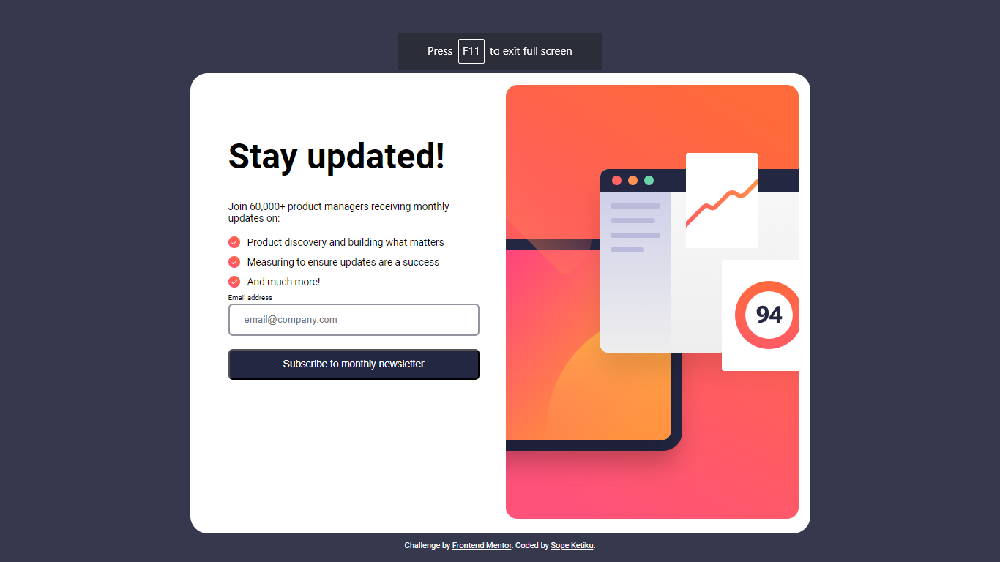

# Frontend Mentor - Newsletter sign-up form with success message solution

This is a solution to the [Newsletter sign-up form with success message challenge on Frontend Mentor](https://www.frontendmentor.io/challenges/newsletter-signup-form-with-success-message-3FC1AZbNrv). Frontend Mentor challenges help you improve your coding skills by building realistic projects.

## Table of contents

-   [Overview](#overview)
    -   [The challenge](#the-challenge)
    -   [Screenshot](#screenshot)
    -   [Links](#links)
-   [My process](#my-process)
    -   [Built with](#built-with)
    -   [What I learned](#what-i-learned)
    -   [Continued development](#continued-development)
    -   [Useful resources](#useful-resources)
-   [Author](#author)
-   [Acknowledgments](#acknowledgments)

## Overview

### The challenge

Users should be able to:

-   Add their email and submit the form
-   See a success message with their email after successfully submitting the form
-   See form validation messages if:
    -   The field is left empty
    -   The email address is not formatted correctly
-   View the optimal layout for the interface depending on their device's screen size
-   See hover and focus states for all interactive elements on the page

### Screenshot




### Links

-   Solution URL: [Solution URL here](https://github.com/ksope/fm-newsletter-signup)
-   Live Site URL: [Live site URL here](https://ksope.github.io/fm-newsletter-signup/)

## My process

### Built with

-   Semantic HTML5 markup
-   CSS custom properties
-   Flexbox
-   Mobile-first workflow
-   JavaScript

### What I learned

I learnt how to save data n the browser's localStorage and retrieve it.

To see how you can add code snippets, see below:

```javascript
form.addEventListener("submit", (e) => {
    e.preventDefault();
    if (email.value === "") {
        showError(email, "Valid email required");
    } else if (!checkEmail(email)) {
        showError(email, "Email is not valid");
    } else {
        const inputValue = email.value;
        localStorage.setItem("userInputValue", inputValue); // Store the value in local storage
        showSuccess(email, "./confirmation.html");
    }
});
```

```javascript
const storedValue = localStorage.getItem("userInputValue");

// Display the email
if (storedValue) {
    document.getElementById("contact").innerText = storedValue;
} else {
    document.getElementById("contact").innerText = "No email found.";
}
```

### Continued development

Unit testing using jest. I intend to implement this feature later.

### Useful resources

-   [Unit Testing resource](https://www.youtube.com/watch?v=zuKbR4Q428o&list=PL3ZfrYLtJ3t225fUijpIysi2AnJl42hLq&index=14&t=11s) - This is an amazing video where I learn more about unit testing in JavaScript. I'd recommend it to anyone still learning this concept.

## Author

-   Portfolio Website - [Sope Ketiku](https://ksopedev-site.netlify.app/)
-   Frontend Mentor - [@ksope](https://www.frontendmentor.io/profile/ksope)
-   LinkedIn - [Sope Ketiku](https://www.linkedin.com/in/sope-ketiku/)

## Acknowledgments

I will like to thank Mosh for his great lessons on Unit testing. Check out his youtube channel on https://www.youtube.com/@programmingwithmosh
